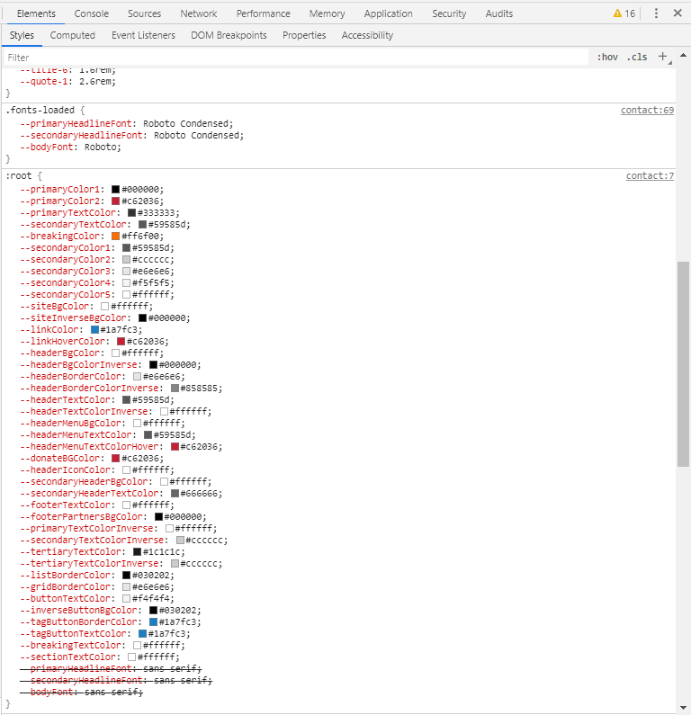

# Custom Stylesheet for Grove CMS

### Contents

* [Project Structure](#project-structure)
* [Getting Started](#getting-started)
* [Generating the Stylesheet](#generating-the-stylesheet)
* [Deploying With Netlify](#deploying-with-netlify)
* [Other Questions and Answers](#other-questions-and-answers)

<br>

### Project Structure

```
grove-custom-css/
├── dist/custom-stylesheet.css     · stylesheet generated by this project
├── sass/                          · source files for the stylesheet
│   ├── _grove-variables.scss      · CSS Custom Properties copied from Grove CMS
│   └── index.scss                 · entry point for stylesheet
│
├── .github/                       · assets for documentation on GitHub
├── node_modules/                  · project dependencies
├── .browserslistrc                · browser support settings for "autoprefixer"
├── .editorconfig                  · basic editor preferences
├── .gitignore                     · file patterns to exclude from repository
├── gruntfile.js                   · Entry point for Grunt build process
├── package-lock.json              · more extensive copy of package.json
├── package.json                   · project details, dependency list, scripts
└── README.md                      · project description - YOU ARE HERE
```

<br>

### Getting Started

To run this project, you must install:

1. **[Node.js](https://nodejs.org/en/)**

2. **A unix-style terminal**, such as:
    * [Git Bash](https://git-scm.com/downloads) (for Windows)
    * [iTerm2](https://www.iterm2.com/) (for Mac)
    * [Hyper](https://hyper.is/)
    * VSCode's [Integrated Terminal](https://code.visualstudio.com/docs/editor/integrated-terminal)

3. **A modern text editor**, such as:
    * [Visual Studio Code](https://code.visualstudio.com/download)
    * [Atom](https://atom.io/)
    * [Sublime Text](https://www.sublimetext.com/)


We'll be using **Node.js** for **Node Package Manager** (NPM), which manages our project dependencies and tooling.

<br>

#### Make sure Node.js installed correctly
Type the following into your terminal. It should return a version number (e.g. `v10.16.2`)
```shell
node --version
```

#### Make sure NPM installed correctly
Type the following into your terminal. It should return a version number (e.g. `6.9.0`)
```shell
npm --version
```

<br>

#### Clone the Repository with Git
From here, you'll need to clone this repository. We use **Git** for Version Control, to keep track of changes to our project. It solves issues with conflicts when multiple people are working with the same project, and makes it easy to identify when a file changed.

It is strongly recommended that you become comfortable with Git in the terminal, and there are plenty of online resources to do so:
* [An Introduction to Git](https://www.freecodecamp.org/news/what-is-git-and-how-to-use-it-c341b049ae61/)
* [Git - The Simple Guide](https://rogerdudler.github.io/git-guide/)
* [Git and GitHub Tutorial for Beginners](https://product.hubspot.com/blog/git-and-github-tutorial-for-beginners)

<br>

#### From The Terminal
1. Navigate to the directory you want to put your local copy in.
2. Clone the repository to your local machine
3. Navigate to this new directory
```shell
git clone https://github.com/ricealexander/grove-custom-stylesheet.git
cd grove-custom-stylesheet
```
<br>

#### With Github Desktop
If you would prefer not to work with git from the terminal, you can install a GUI, such as [Github Desktop](https://desktop.github.com/). This will give you a visual representation of what files have been changed with controls for most basic git tasks.

1. [Download](https://desktop.github.com/) Github Desktop and connect your Github account.
2. When prompted, choose a default location to save your repository (defaults to _Documents/Github_ on Windows).
3. When prompted, choose to Clone an existing repository and select "grove-custom-stylesheet" from the drop-down list.

Open your terminal and navigate to this new directory.

<br>

### Install Project Dependencies and Tooling
From the terminal, in your "grove-custom-stylesheet" directory, type the following to install the project dependencies: (this may take a while)
```shell
npm install
```

Now everything should be set up so that we can run our project on the command line. **package.json** is a file that exists to identify our project to NPM and store our dependencies and scripts. Anything listed under "scripts" can be run with the `npm run` command.

For example, this command would run our build script:
```shell
npm run build
```

<br>

### Generating the Stylesheet

By this point you should have this project cloned and the dependencies installed.

1. **Customize `sass/_grove-variables.scss` with your theme settings.** If you'd like to find a list of all of your Grove variables, you can navigate to any page of the production site, open your Developer tools with `Ctrl + Shift + I`, and scroll to the bottom of the Styles panel under the Elements tab, for a selector called `:root{}`.

    

    The easiest way to update `sass/_grove-variables.scss` is to copy the list of custom properties from `:root {}`, paste them into _grove-variables.scss, and perform a find and replace to turn `--` into `$`.

2. **Run `npm run build` from your terminal** to generate the stylesheet. There should now be a file called `dist/custom-stylesheet.css` with the updated sheet.

<br>

### Deploying With Netlify

[Netlify](https://www.netlify.com/) is an ideal hosting site for a project like this. It's free, fast, and can be set to automatically re-build the project when it changes.

The easiest approach is to [Sign Up](https://app.netlify.com/signup) with your GitHub account. Once signed up, you should be taken to your team page.

Click "Create a new site", "GitHub" under Continous Deployment, and select your repo. (You will likely need to request permissions)

// More documentation here. Still need to set this up

<br>

### Other Questions and Answers

**Question: How can I rename custom-stylesheet.css?**
<br>Answer: The name of the stylesheet is controlled in `gruntfile.js` under sass > dist
